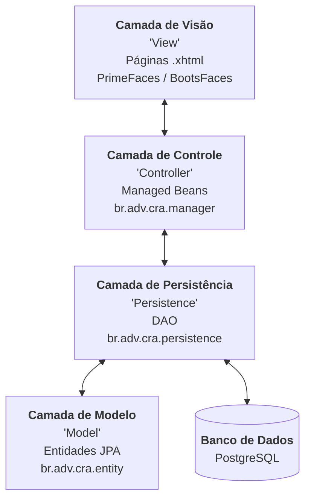

# SISGECOL

 **Primeira versão   Date: 01/06/2012  Author: Nelson Seixas**

- **Sistema de Gerenciamento de Colaboradores**

 * Sistema de controle de digilências e audiências
 * Autor:Nelson Seixas de Souza -Java Web Deveoper Data de Inicio:
 * CopyRight: Nelson Seixas de Souza (Java Web Developer)
 * Date: 01/06/2012

- Sistema feito pra gestão de solicitações de audiências e diligências

- Descrição da feature

- Java, Hibernate, PostgresSQL, Tom Cat, JSF 

## Frameworks Utilizados

O projeto utiliza as seguintes tecnologias e versões:

- **JSF (JavaServer Faces) 2.0**: Framework MVC para construção de interfaces web.
- **PrimeFaces 3.4.2**: Biblioteca de componentes UI para JSF.
- **BootsFaces 1.2.0**: Biblioteca baseada em Bootstrap para layouts responsivos.
- **Hibernate 4.3.11.Final**: Framework de ORM para mapeamento objeto-relacional.
- **JasperReports 6.6.0**: Engine para geração de relatórios.
- **PostgreSQL**: Banco de dados relacional.
- **Apache Tomcat**: Servidor de aplicação.

## Arquitetura

O sistema segue uma arquitetura baseada no padrão **MVC (Model-View-Controller)** adaptada para o framework JSF:

### Descrição das Camadas:

- **Visão (View):** Interface do usuário construída com JSF, PrimeFaces e BootsFaces para componentes responsivos.
- **Controle (Controller):** Managed Beans que gerenciam a lógica de interação entre a interface e as regras de negócio.
- **Persistência (Persistence):** Implementa o padrão DAO utilizando Hibernate para gerenciar o acesso aos dados.
- **Modelo (Model):** Representa as entidades do domínio, mapeadas para o banco de dados via JPA.

### Camada de Persistência (DAO)

A camada de persistência utiliza o padrão DAO (Data Access Object) para abstrair o acesso ao banco de dados PostgreSQL através do Hibernate. As principais classes são:

- `SolicitacaoDao`: Gerencia todas as operações de CRUD e consultas complexas relacionadas às solicitações de audiências e diligências.
- `UsuarioDao`: Responsável pela gestão de usuários do sistema, incluindo autenticação e controle de permissões.
- `CorrespondenteDao`: Gerencia o cadastro e vínculo de correspondentes (colaboradores externos).
- `ProcessoDao`: Lida com as informações dos processos judiciais vinculados às solicitações.
- `HibernateUtil`: Classe utilitária que gerencia a `SessionFactory` do Hibernate, garantindo o fornecimento de sessões para os DAOs.

### Páginas do Sistema (View)

As interfaces são desenvolvidas em JSF e organizadas em módulos dentro do diretório `WebContent`:

- **Solicitações (`/solicitacao`)**:
    - `solicitacao.xhtml`: Painel principal com a listagem e filtros de solicitações.
    - `novasolicitacao.xhtml`: Formulário para abertura de novas demandas.
    - `alterasolicitacao.xhtml`: Edição e acompanhamento de solicitações existentes.
- **Correspondentes (`/correspondente`)**:
    - `correspondente.xhtml`: Gerenciamento da rede de colaboradores.
    - `cadcorrespondente.xhtml`: Cadastro detalhado de novos correspondentes.
- **Processos (`/processo`)**:
    - `bancaprocesso.xhtml`: Gestão das bancas examinadoras/vinculadas.
    - `importadorcppro.xhtml`: Ferramenta de integração/importação de dados.
- **Financeiro (`/financeiro`)**:
    - `financeiro.xhtml`: Controle de pagamentos e repasses aos correspondentes.
- **Administração (`/usuario`)**:
    - `usuario.xhtml`: Gestão de usuários e perfis de acesso.

### Relatórios

O sistema utiliza o **JasperReports 6.6.0** para a geração de documentos e relatórios técnicos/financeiros.

- **Localização dos Templates:** Os arquivos de definição de relatório (`.jrxml` e `.jasper`) estão localizados em `WebContent/WEB-INF/relatorios`.
- **Principais Relatórios:**
    - `pagamento.jrxml`: Relatório de pagamentos processados.
    - `faturamento.jrxml`: Demonstrativo de faturamento.
    - `RelFormulario.jrxml`: Relatório detalhado de formulários de audiência.
    - `acordorealizados.jrxml`: Estatísticas de acordos efetuados.

- Última alteração 13/01/2021 12:00 PM

- Foi importado para o GITLAB criado

