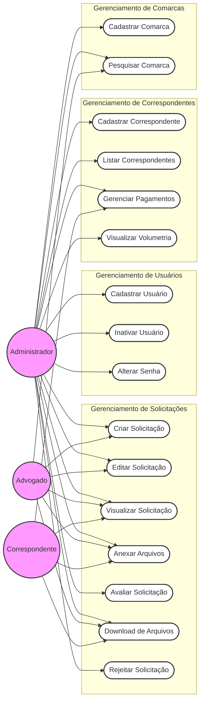

# Use Case Diagram

This diagram represents the system's actors and their interactions with the key functionalities (Use Cases).
**Note:** Displayed using Flowchart syntax for maximum compatibility.

